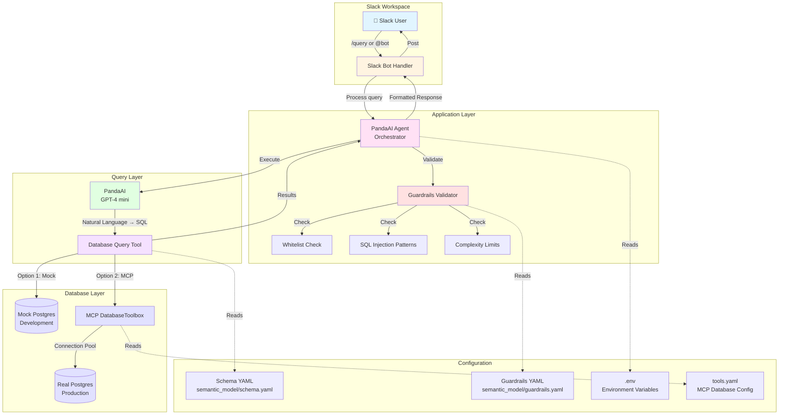
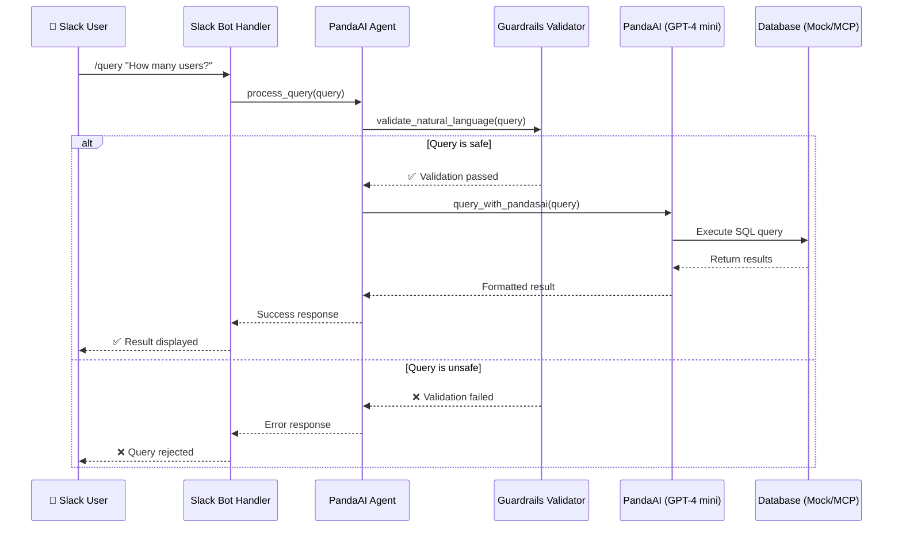
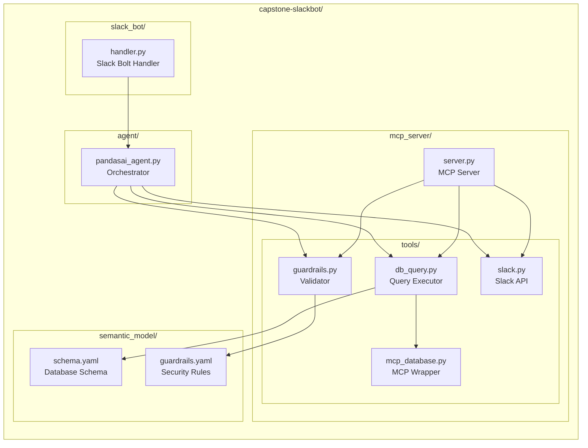
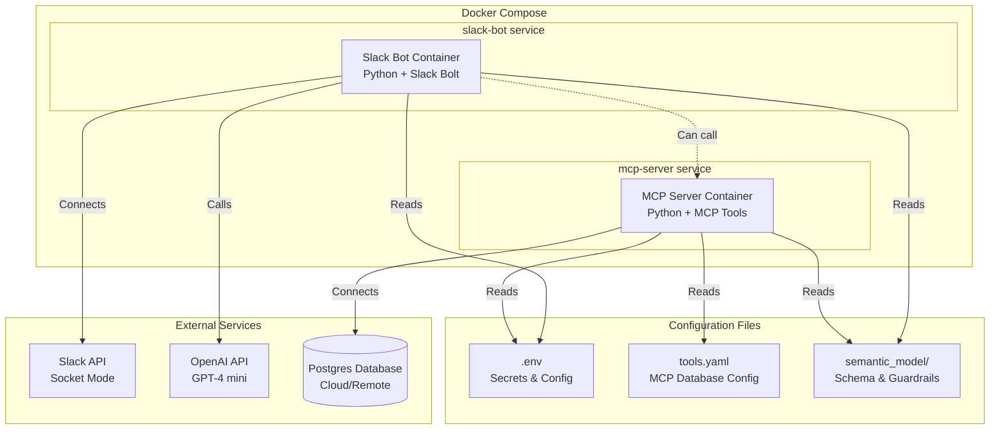
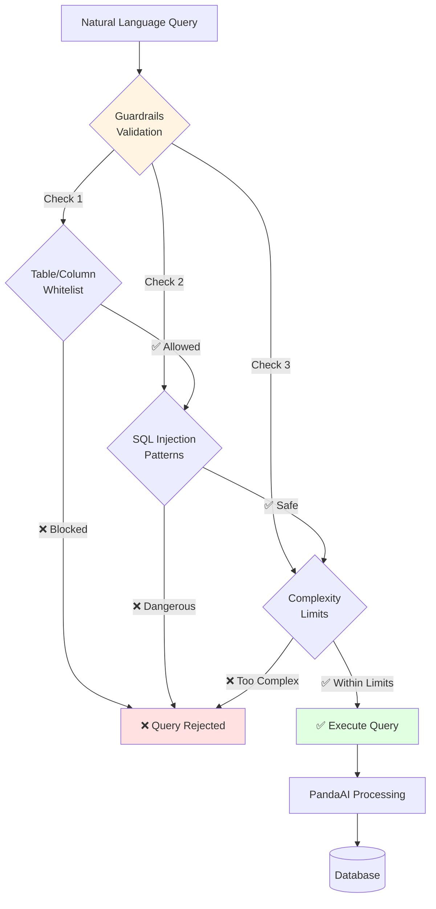
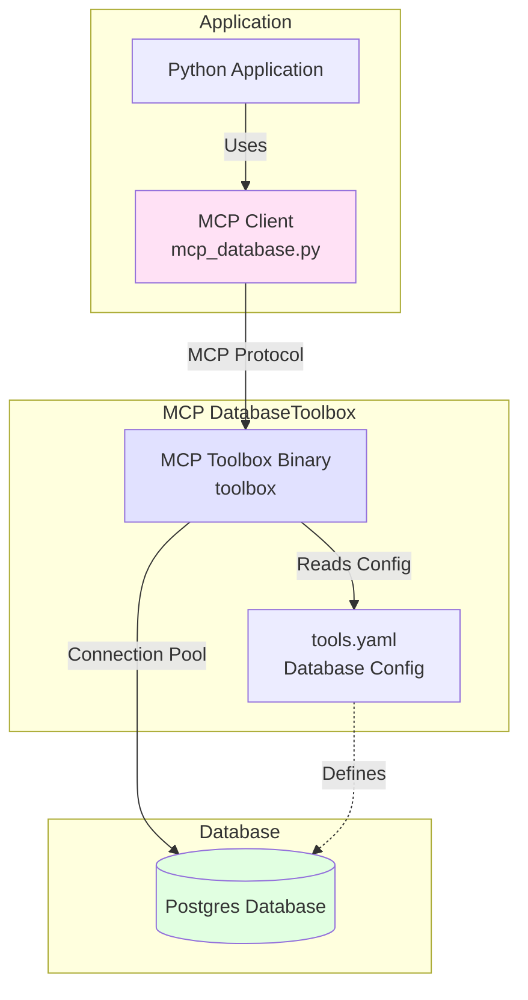
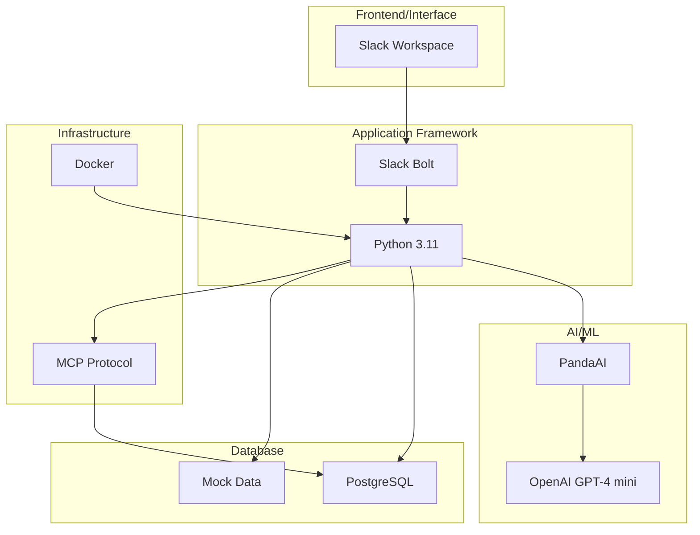

# Architecture Diagram

## System Architecture



## Data Flow



## Component Architecture



## Deployment Architecture



## Security Flow



## MCP DatabaseToolbox Integration



## File Structure

```
capstone-slackbot/
├── 📁 slack_bot/
│   └── handler.py          → Slack Bolt handler
├── 📁 agent/
│   └── pandasai_agent.py  → Main orchestrator
├── 📁 mcp_server/
│   ├── server.py          → MCP server
│   └── 📁 tools/
│       ├── guardrails.py  → Security validator
│       ├── db_query.py    → Database queries
│       ├── mcp_database.py → MCP wrapper
│       └── slack.py       → Slack posting
├── 📁 semantic_model/
│   ├── schema.yaml        → Database schema
│   └── guardrails.yaml   → Security rules
├── .env                   → Environment variables (handmatig)
├── tools.yaml             → MCP config (van tools.yaml.example)
├── docker-compose.yml     → Docker orchestration
└── Dockerfile             → Container definition
```

## Technology Stack



---

## Export naar Excalidraw

Als je deze diagrammen in Excalidraw wilt gebruiken:

1. **Mermaid → Excalidraw:**
   - Gebruik [Mermaid Live Editor](https://mermaid.live/)
   - Exporteer als SVG
   - Importeer in Excalidraw

2. **Handmatig tekenen:**
   - Gebruik de bovenstaande diagrammen als referentie
   - De componenten en flows zijn duidelijk beschreven

3. **Online tools:**
   - [Mermaid Live Editor](https://mermaid.live/) - voor Mermaid diagrammen
   - [Excalidraw](https://excalidraw.com/) - voor handgetekende diagrammen
   - [Draw.io](https://app.diagrams.net/) - voor professionele diagrammen

Deze Mermaid diagrammen worden automatisch gerenderd op GitHub, GitLab, en in veel markdown viewers!

