# Architecture Diagram

## Design outline


## High Level Design


## System & Subsystem Architecture


## System Architecture


## Data Flow

```mermaid
sequenceDiagram
    participant User as 👤 Slack User
    participant Bot as Slack Bot Handler
    participant Agent as PandaAI Agent
    participant Guardrails as Guardrails Validator
    participant QueryTool as Database Query Tool
    participant PandaAI as PandasAI Agent<br/>(LiteLLM + GPT-4o-mini)
    participant Cache as DataFrame Cache
    participant DB as Database (Mock/Direct/MCP)
    
    User->>Bot: /query "How many users?"
    Bot->>Agent: process_query(query)
    Agent->>Guardrails: validate_natural_language(query)
    
    alt Query is safe
        Guardrails-->>Agent: ✅ Validation passed
        Agent->>QueryTool: query_with_pandasai(query)
        QueryTool->>Cache: Check cache
        
        alt Cache hit
            Cache-->>QueryTool: Return cached dataframes
        else Cache miss
            QueryTool->>DB: Load dataframes
            DB-->>QueryTool: Return dataframes
            QueryTool->>Cache: Store in cache (TTL: 3600s)
        end
        
        QueryTool->>PandaAI: Create Agent with dataframes
        PandaAI->>PandaAI: Generate pandas code<br/>(NO SQL queries)
        PandaAI->>PandaAI: Execute pandas operations
        PandaAI-->>QueryTool: Return results
        QueryTool-->>Agent: Formatted result
        Agent-->>Bot: Success response
        Bot-->>User: ✅ Result displayed
    else Query is unsafe
        Guardrails-->>Agent: ❌ Validation failed
        Agent-->>Bot: Error response
        Bot-->>User: ❌ Query rejected
    end
```



## Component Architecture


## Deployment Architecture


## Security Flow


## MCP DatabaseToolbox Integration


## File Structure

```
capstone-slackbot/
├── pyproject.toml          → Poetry config (dependencies, entry points)
├── AGENTS.md               → Cursor development rules
├── PROJECT_CONTEXT.md      → Project scope & goals
├── ARCHITECTURE.md         → This file
├── .env.example            → Template for environment variables
├── README.md               → Setup & run instructions
├── capstone_slackbot/      → Main package directory
│   ├── __init__.py
│   ├── main.py             → Entry point (poetry run slack-bot)
│   ├── agent/              → Agent orchestrator subsystem
│   │   └── pandasai_agent.py
│   ├── mcp_server/         → MCP server subsystem
│   │   ├── server.py       → MCP server (poetry run mcp-server)
│   │   └── tools/          → MCP tools
│   │       ├── guardrails.py    → Security validator
│   │       ├── db_query.py      → Database queries (PandasAI Agent)
│   │       ├── mcp_database.py  → MCP wrapper
│   │       ├── mock_database.py → Mock database implementation
│   │       └── slack.py         → Slack posting
│   └── slack_bot/          → Slack bot subsystem
│       ├── handler.py      → Slack Bolt handler
│       └── mock_slack.py   → CLI mock mode
├── semantic_model/         → Schema & security config
│   ├── schema.yaml        → Database schema
│   └── guardrails.yaml    → Security rules
├── tests/                  → Test suite
│   ├── test_guardrails.py → Guardrails tests
│   └── test_setup.py      → Setup verification tests
├── tools.yaml.example      → MCP config template
├── docker-compose.yml      → Docker orchestration
└── Dockerfile              → Container definition
```

## Technology Stack


## Key Architecture Decisions

### PandasAI Agent with Multiple DataFrames
- **Why**: Enables queries across multiple tables (e.g., users + subscriptions)
- **Implementation**: Uses `PandasAI Agent` with a list of `SmartDataframes` instead of single `SmartDataframe`
- **Benefit**: Better multi-table query support without manual joins

### SQL Queries Disabled
- **Why**: DuckDB compatibility issues with certain SQL functions (e.g., `sequence()`)
- **Implementation**: `enable_sql_query: False` in PandasAI config + custom instructions
- **Benefit**: Uses only pandas operations (merge, groupby, filter) which are more reliable

### DataFrame Caching
- **Why**: Reduce database load for repeated queries
- **Implementation**: In-memory cache with configurable TTL (default: 3600s)
- **Benefit**: Faster response times and reduced database connections

### LiteLLM Integration
- **Why**: Flexible LLM provider abstraction
- **Implementation**: Uses `pandasai-litellm` package with LiteLLM wrapper
- **Benefit**: Easy to switch LLM providers or models (currently GPT-4o-mini)

### Mock Classes Separation
- **Why**: Better code organization and readability
- **Implementation**: `mock_database.py` and `mock_slack.py` as separate modules
- **Benefit**: Cleaner codebase, easier to maintain and test

### Package Structure
- **Why**: Standard Python package layout for better distribution
- **Implementation**: `capstone_slackbot/` as main package with `main.py` entry point
- **Benefit**: Proper Python package structure, Poetry scripts integration

---

## Export naar Excalidraw

Als je deze diagrammen in Excalidraw wilt gebruiken:

1. **Mermaid → Excalidraw:**
   - Gebruik [Mermaid Live Editor](https://mermaid.live/)
   - Exporteer als SVG
   - Importeer in Excalidraw

2. **Handmatig tekenen:**
   - Gebruik de bovenstaande diagrammen als referentie
   - De componenten en flows zijn duidelijk beschreven

3. **Online tools:**
   - [Mermaid Live Editor](https://mermaid.live/) - voor Mermaid diagrammen
   - [Excalidraw](https://excalidraw.com/) - voor handgetekende diagrammen
   - [Draw.io](https://app.diagrams.net/) - voor professionele diagrammen

Deze Mermaid diagrammen worden automatisch gerenderd op GitHub, GitLab, en in veel markdown viewers!

